##############################################################################
0. Getting Ready (Important)
##############################################################################

Before starting building the projects, you need to make some preparation first, which is so crucial that you must not skip.

Programming Software
********************************

We use Arduino® IDE to write and upload code for the control board, which is a free and open source.

(Arduino® is a trademark of Arduino LLC.)

Arduino IDE uses C/C++ programming language. Don't worry if you have never used it, because this document contains programming knowledge and detailed explanation of the code.

First, install Arduino IDE. Visit https://www.arduino.cc/en/software. Scroll down and find Arduino IDE (2.3.X). Then select and download corresponding installer according to your operating system. If you are a windows user, please select the "Windows Installer".

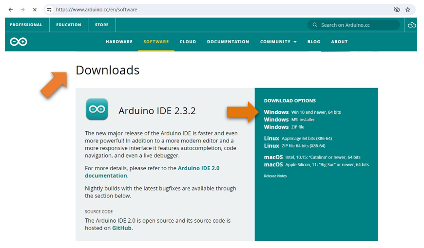

After the downloading completes, run the installer. For Windows users, there may pop up an installation dialog box of driver during the installation process. When it is popped up, please allow the installation.

After installation is completed, an shortcut will be generated in the desktop.

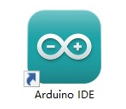

Run it. The interface of the software is as follows:

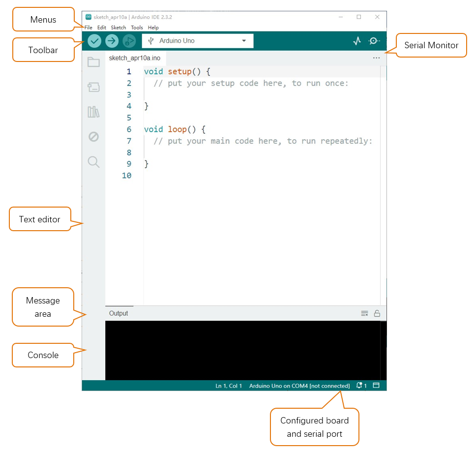

Programs written with Arduino IDE are called sketches. These sketches are written in a text editor and are saved with the file extension.ino. The editor has features for cutting/pasting and for searching/replacing text. The message area gives feedback while saving and exporting and also displays errors. The console displays text output by the Arduino IDE, including complete error messages and other information. The bottom right-hand corner of the window displays the configured board and serial port. The toolbar buttons allow you to verify and upload programs, create, open, and save sketches, and open the serial monitor.

.. list-table:: 
   :width: 100%
   :align: center

   * -  |Chapter00_03|
     -  Verify 
        
        Checks your code for errors compiling it. 

   * -  |Chapter00_04|
     -  Upload
         
        Compiles your code and uploads it to the configured board. 

   * -  |Chapter00_05|
     -  New 
        
        Creates a new sketch. 

   * -  |Chapter00_06|
     -  Open 
        
        Presents a menu of all the sketches in your sketchbook.
        
        Clicking one will open it within the current window overwriting its content. 

   * -  |Chapter00_07|
     -  Save 

        Saves your sketch. 

   * -  |Chapter00_08|
     -  Serial Monitor
        
        Opens the serial monitor. 

Additional commands are found within five menus: File, Edit, Sketch, Tools, Help. The menus are context sensitive, which means only those items relevant to the work currently being carried out are available.

In addition, the Arduino 2.X.X version provides a quick search bar for control board management and a quick search bar for libraries, so you can easily install the library files and control board support package you want.

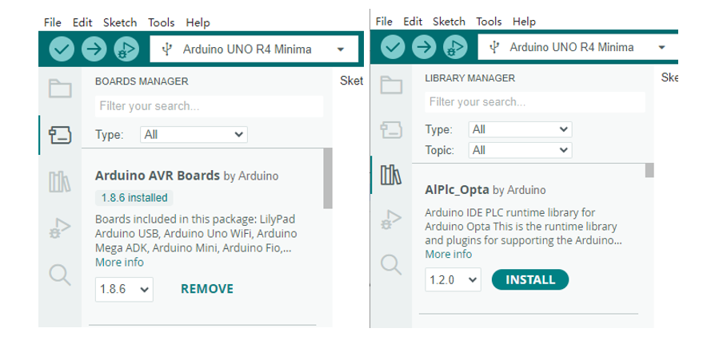

Installation of Development Board Support Package

1.	Open Arduino IDE. Click Tools>Board>Boards Manager...on the menu bar.

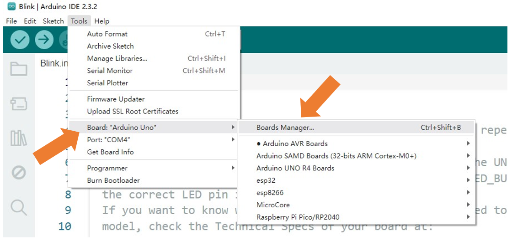

2. Enter **Arduino UNO R4** in the searching box, and select " **Arduino UNO R4** " and click on Install.

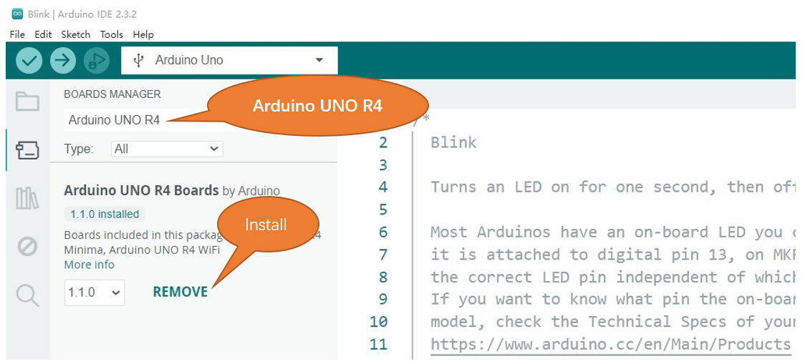

Click Yes in the pop-up " **dpinst-amd64.exe** "installation window. (Without it, you will fail to communicate with Arduino.) Thus far, we have finished installing the development support package.

First Use
********************************

Open the example sketch "Blink".

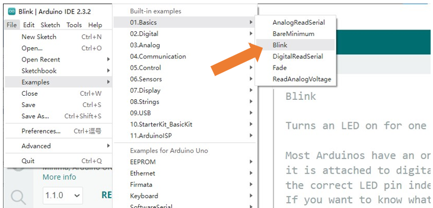

Select the board corresponding to the board you have in hands. Here we take Freenove Control Board (minina) as an example:

Select board "Arduino Uno R4 Minima". (Freenove control board is compatible with this board.)

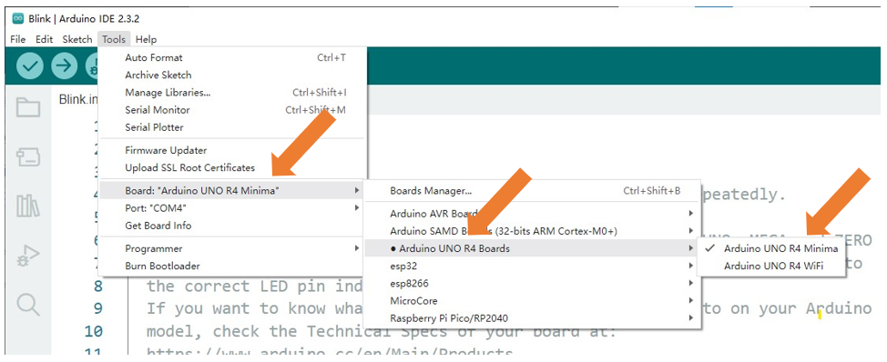

Select the port.

.. note::
    
    Your port may be different from the following figure.

On Windows: It may be **COM4** , **COM5** (Arduino Uno R4 Minima) or something like that.

On Mac: It may be **/dev/cu.usbserial-710** , **/dev/cu.usemodem7101** (Arduino Uno R4 Minima) or something like that.

On Linux: It may be **/dev/ttyUSB0** , **/dev/ttyACM0** or something like that.

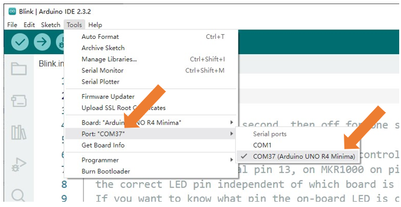

.. note::
    
    If there is more than one port and you cannot decide which one to choose, disconnect the USB cable and check the port. Then connect the USB cable and check the port again. The new one is the correct port.

:red:`Having problems?` Contact us for help! Send mail to: support@freenove.com

Click "Verify" button.

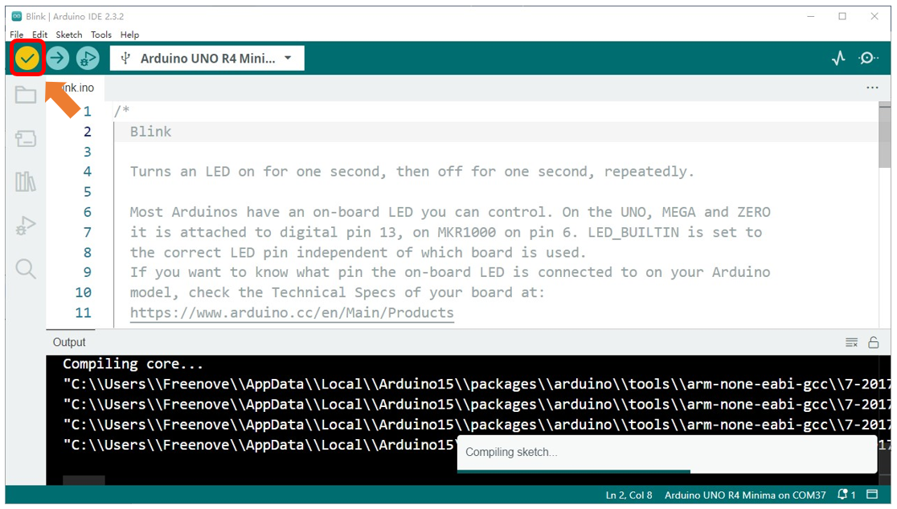

The following figure shows the code being compiled.

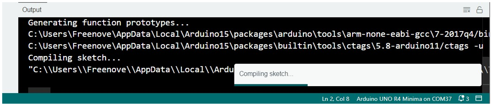

Wait a moment for the compiling to be completed. Figure below shows the code size and percentage of space occupation. If there is an error in the code, the compilation will fail and the details are shown here.

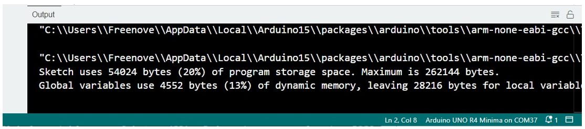

Click "Upload" button.

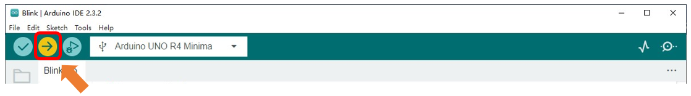

Figure below shows code are uploading. 

.. image:: ../_static/imgs/0_Ready/Chapter00_19.png
    :align: center

Wait a moment, and then the uploading is completed.

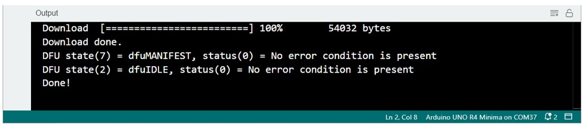

:red:`Having problems?` Contact us for help! Send mail to: support@freenove.com

After that, we will see the LED marked with "L" on the control board start blinking. It indicates that the code is running now!

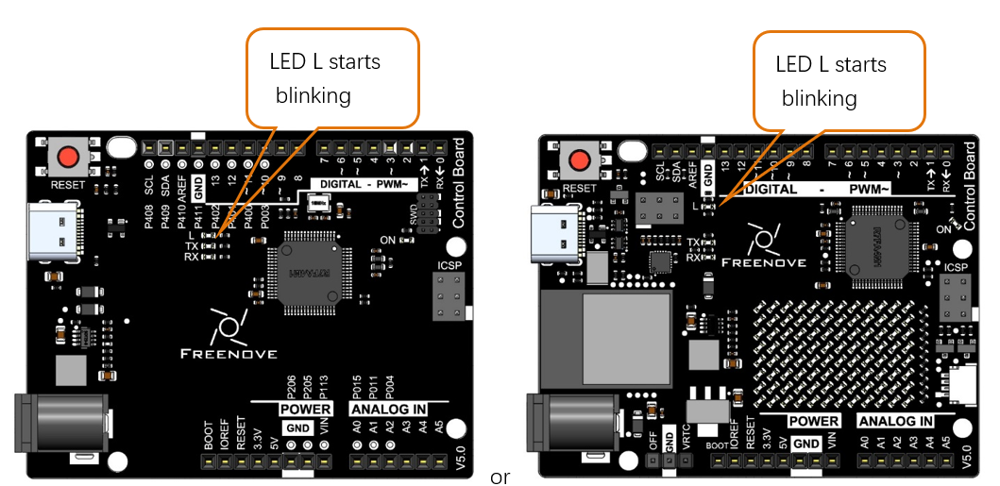

So far, we have completed the first use. I believe you have felt the joy of it. Next, we will carry out a series of projects, from easy to difficult, taking you to learn programming and the building of electronic circuit.

How to install the library
****************************************

There are two ways to include libraries on Arduino IDE.

The first way, open the Arduino IDE, click Tools -> Manager Libraries.

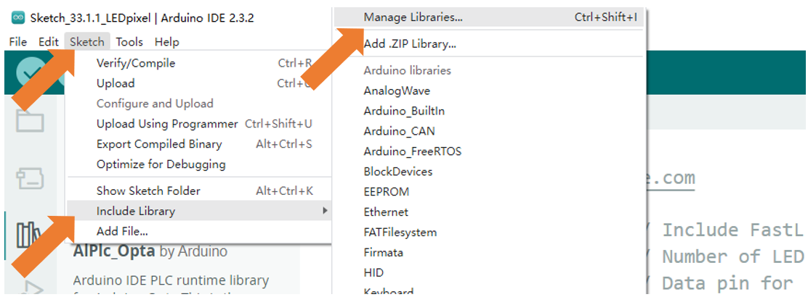

Here we take installing the "FastLED" library as an example. In the pop-up window, Library Manager, search for the name of the Library, "FastLED". Then click Install.

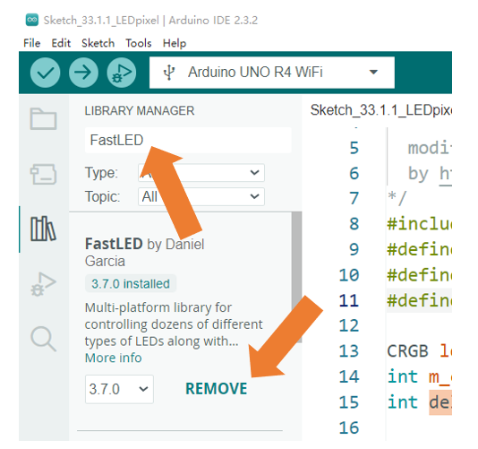

Or, you can click the Library icon on the left of Arduino IDE, and type in 'FastLED' on the search bar to install. 

.. image:: ../_static/imgs/0_Ready/Chapter00_24.png
    :align: center

The second way, open Arduino IDE, click Sketch -> Include Library -> Add .ZIP Library. In the pop-up window, find the file named "./Libraries/FastLED.Zip" which locates in this directory, and click OPEN.

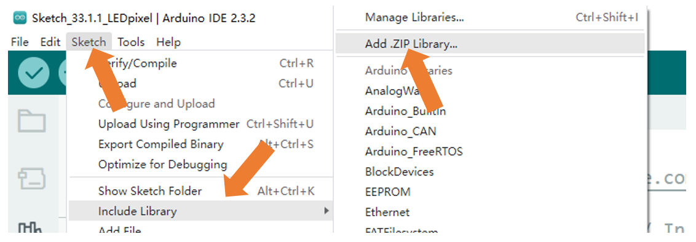