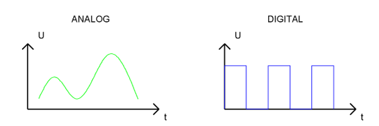
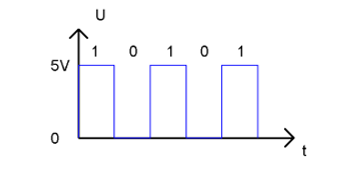
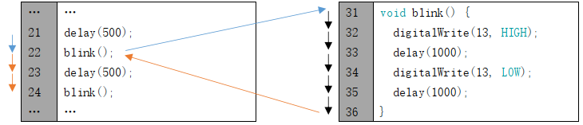
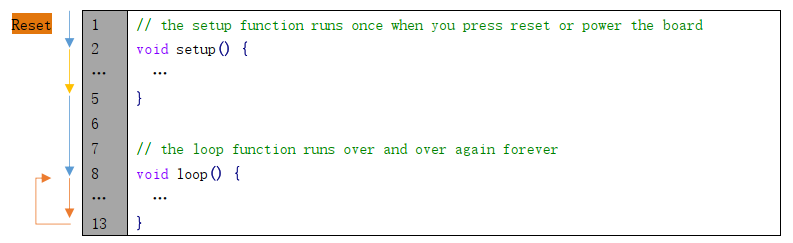
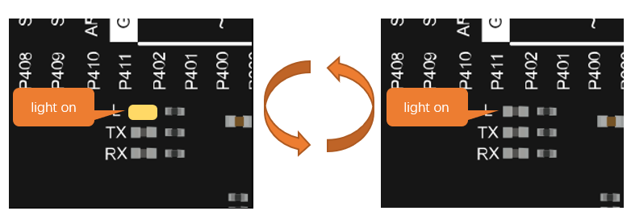

##############################################################################
Chapter LED Blink
##############################################################################

We have previously tried to make the LED marked with "L" blink on the control board. Now let us use electronic components and codes to reproduce the phenomenon, and try to understand their principle.

Project Control LED with Control Board
****************************************************

Now, try using control board to make LED blink through programing.

Component List
========================

Components are basically the same with those in last section. Push button switch is no more needed. 

Circuit Knowledge
=======================

Analog signal and Digital signal
-----------------------------------------

An Analog Signal is a continuous signal in both time and value. On the contrary, a Digital Signal or discrete-time signal is a time series consisting of a sequence of quantities. Most signals in life are analog signals. A familiar example of an Analog Signal would be how the temperature throughout the day is continuously changing and could not suddenly change instantaneously from 0℃ to 10℃. 

However, Digital Signals can instantaneously change in value. This change is expressed in numbers as 1 and 0 (the basis of binary code). Their differences can more easily be seen when compared when graphed as below.

In practical applications, we often use binary as the digital signal, that is a series of 0's and 1's. Since a binary signal only has two values (0 or 1) it has great stability and reliability. Lastly, both analog and digital signals can be converted into the other.

Low level and high level
--------------------------------

In a circuit, the form of binary (0 and 1) is presented as low level and high level.

Low level is generally equal to ground voltage(0V). High level is generally equal to the operating voltage of components.

The low level of the control board is 0V and high level is 5V, as shown below. When IO port on control board outputs high level, components of small power can be directly lit, like LED.

Code Knowledge
=================================

Before start writing code, we should learn about the basic programming knowledge.

Comments
------------------------------

Comments are the words used to explain for the sketches, and they won't affect the running of code.

There are two ways to use comments of sketches.

1.	Symbol "//"

Contents behind "//" comment out the code in a single line.

.. code-block:: C

    // this is a comment area in this line.

The content in front of "//" will not be affected.

.. code-block:: C

    delay(1000);              // wait for a second

2.	Symbol "/*"and "*/"

Code can also be commented out by the contents starting with a "/*" and finishing with a "*/" and you can place it anywhere in your code, on the same line or several lines.

.. code-block:: C

    /* this is comment area. */

Or

.. code-block:: C

    /* 
        this is a comment line. 
        this is a comment line. 
    */

Data type
------------------------

When programming, we often use digital, characters and other data. C language has several basic data types as follows: 

int: A number that does not have a fractional part, an integer, such as 0, 12, -1;

float: A number that has a fractional part, such as 0.1, -1.2;

char: It means character, such as 'a', '@', '0';

For more about date types, please visit the website: https://www.Arduino.cc-Resources-Reference-Data Types.

Constant
-------------------------

A constant is a kind of data that cannot be changed, such as int type 0, 1, float type 0.1, -0.1, char type 'a', 'B'.

Variable
-------------------------

A variable is a kind of data that can be changed. It consists of a name, a value, and a type. Variables need to be defined before using, such as:

.. code-block:: C

    int i;

"int" indicates the type, ";" indicates the end of the statement. The statement is usually written in one single line; and these statements form the code.

After declaration of the variable, you can use it. The following is an assignment to a variable:

.. code-block:: C

    i = 0;                    // after the execution, the value of i is 0

"=" is used to pass the value of a variable or constant on the right side to the variable on the left.

A certain number of variables can be declared in one statement, and a variable can be assigned multiple times. Also, the value of a variable can be passed to other variables. For example:

.. code-block:: C

    int i, j;
    i = 0;                    // after the execution, the value of i is 0
    i = 1;                    // after the execution, the value of i is 1
    j = i;                    // after the execution, the value of j is 1

Function
----------------------

A function is a collection of statements with a sequence of order, which performs a defined task. Let's define a function void blink() as follows:

.. code-block:: C

    void blink() {
        digitalWrite(13, HIGH);
        delay(1000);
        digitalWrite(13, LOW);
        delay(1000);
    }

"void" indicates that the function does not return a value (Chapter 4 will detail the return value of functions); 

"()" its inside is parameters of a function (Chapter 2 will detail the parameters of the functions). No content inside it indicates that this function has no parameters;

"{}" contains the entire code of the function.

After the function is defined, it is necessary to be called before it is executed. Let's call the function void blink(), as shown below.

.. code-block:: C

    blink();

When the code is executed to a statement calling the function, the function will be executed. After execution of the function is finished, it will go back to the statement and execute the next statement.

Some functions have one or more parameters. When you call such functions, you need to write parameters inside "()":

.. code-block:: C

    digitalWrite(13, HIGH);   // turn the LED on (HIGH is the voltage level)
    delay(1000);              // wait for a second

Sketch
======================

Sketch Control_LED_by_Control_Board
----------------------

In order to make the LED blink, we need to make pin 13 of the control board output high and low level alternately.

We highly recommend you type the code manually instead of copying and pasting, so that you can develop your coding skills and get more knowledge.

.. literalinclude:: ../../../freenove_Kit/Sketches/Sketch_1.2.1_Control_LED_by_Control_Board/Sketch_1.2.1_Control_LED_by_Control_Board.ino
    :linenos: 
    :language: c
    :lines: 1-20
    :dedent:

The code usually contains two basic functions: void setup() and void loop(). 

After control board is :orange:`reset` , the setup() function will be executed first, and then the loop() function will be executed.

setup() function is generally used to write code to initialize the hardware. And loop() function is used to write code to achieve certain functions. loop() function is executed repeatedly. When the execution reaches the end of loop(), it will jump to the beginning of loop() to run again.

.. py:function:: Reset	
    
    Reset operation will lead the code to be executed from the beginning. Switching on the power, finishing uploading the code and pressing the reset button will trigger reset operation.

In the setup () function, first, we set pin 13 of the control board as output mode, which can make the port output high level or low level.

.. literalinclude:: ../../../freenove_Kit/Sketches/Sketch_1.2.1_Control_LED_by_Control_Board/Sketch_1.2.1_Control_LED_by_Control_Board.ino
    :linenos: 
    :language: c
    :lines: 10-11
    :dedent:

Then, in the loop () function, set pin 13 of the control board to output high level to make LED light up.

.. literalinclude:: ../../../freenove_Kit/Sketches/Sketch_1.2.1_Control_LED_by_Control_Board/Sketch_1.2.1_Control_LED_by_Control_Board.ino
    :linenos: 
    :language: c
    :lines: 16-16
    :dedent:

Wait for 1000ms, which is 1s. delay() function is used to make control board wait for a moment before executing the next statement. The parameter indicates the number of milliseconds to wait for.

.. literalinclude:: ../../../freenove_Kit/Sketches/Sketch_1.2.1_Control_LED_by_Control_Board/Sketch_1.2.1_Control_LED_by_Control_Board.ino
    :linenos: 
    :language: c
    :lines: 17-17
    :dedent:

Then set the 13 pint to output low level, and LED light off. One second later, the execution of loop () function will be completed. 

.. literalinclude:: ../../../freenove_Kit/Sketches/Sketch_1.2.1_Control_LED_by_Control_Board/Sketch_1.2.1_Control_LED_by_Control_Board.ino
    :linenos: 
    :language: c
    :lines: 18-19
    :dedent:

The loop() function is constantly being executed, so LED will keep blinking.

The functions called above are standard functions of the Arduino IDE, which have been defined in the Arduino IDE, and they can be called directly. We will introduce more common standard functions in later chapters.

For more standard functions and the specific use method, please visit https://www.arduino.cc-Resources-Reference-Functions.

Verify and upload the code, then the LED starts blinking.

