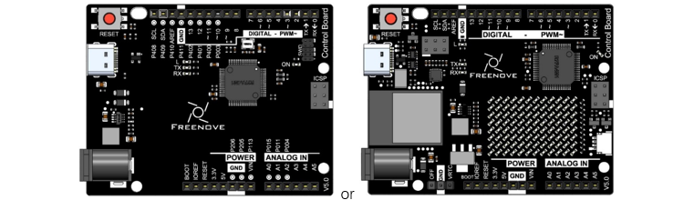

##############################################################################
Chapter RTC
##############################################################################

In this chapter, we explore how to access the Real-Time Clock (RTC) on the Control board (V5). The RTC is embedded in the microcontroller (RA4M1) of the Control board (V5).

Project RTC
******************************

With this project, let's delve into controlling the RTC function of the control board, applying it to flash the indicator every two seconds.

Component List
======================================

.. list-table:: 
   :width: 100%
   :align: center

   * -  Control board x1
   * -  |Chapter06_00|
   * -  USB cable x1
   * -  |Chapter06_01|

Component Knowledge
=========================================

RTC
------------------------------------------

The Real-Time Clock (RTC) is integrated into the microcontroller (RA4M1) of the control board, serving as an independent timekeeping devices that continues to operate even when the primary source of power is off or unavailable. This is achieved thanks to a backup power source, such as a battery. Such feature significantly enhances the RTC's utility across a spectrum of applications, from automating tasks in home systems to timestamping data entries in logging applications.

It should be highlighted that the control board (WiFi) is equipped with a VRTC pin that sustains the RTC's functionality when the board is not powered. To engage this functionality, a voltage between 1.6 and 3.6 V must be supplied to the VRTC pin. It is crucial to stay within this voltage range to avoid damaging the board. It is also important to recognize that this advanced feature is exclusive to the control board with WiFi function and is not available in the standard models.

Circuit
=========================================

Connect the board to the computer using the USB cable.

.. image:: ../_static/imgs/7_Timer/Chapter07_01.png
    :align: center

Sketch
===================================

Sketch RTC
--------------------------------

Upload the sketch to the board and you will see the onboard LED flash every two seconds.

.. literalinclude:: ../../../freenove_Kit/Sketches/Sketch_12.1.1_RTC/Sketch_12.1.1_RTC.ino
    :linenos: 
    :language: c
    :dedent:

Initialize RTC.

.. literalinclude:: ../../../freenove_Kit/Sketches/Sketch_12.1.1_RTC/Sketch_12.1.1_RTC.ino
    :linenos: 
    :language: c
    :lines: 21-21
    :dedent:

Configure the time for RTC. 

.. literalinclude:: ../../../freenove_Kit/Sketches/Sketch_12.1.1_RTC/Sketch_12.1.1_RTC.ino
    :linenos: 
    :language: c
    :lines: 23-24
    :dedent:

A periodic interrupt allows you to set a recurring callback. Set the periodcallback to triger once every two seconds.

.. literalinclude:: ../../../freenove_Kit/Sketches/Sketch_12.1.1_RTC/Sketch_12.1.1_RTC.ino
    :linenos: 
    :language: c
    :lines: 27-29
    :dedent:

Change the status of the LED every two seconds.

.. literalinclude:: ../../../freenove_Kit/Sketches/Sketch_12.1.1_RTC/Sketch_12.1.1_RTC.ino
    :linenos: 
    :language: c
    :lines: 34-39
    :dedent: