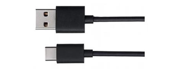

##############################################################################
Chapter Onboard LED Matrix (WiFi Board)
##############################################################################

In this chapter, we utilize the LED matrix on the control board to display interesting patterns. The control board features a built-in 12x8 LED matrix that can be programmed to display graphics, animations, serve as an interface, and even play games. 

Project LED Matrix
*********************************

In this section, we will use the LED matrix to display static graghics.

Component List
==============================

.. list-table:: 
   :width: 100%
   :align: center

   * -  Schematic diagram
   * -  |Chapter19_00|
   * -  Hardware connection 
     
        If you need any support, please feel free to contact us via: support@freenove.com

   * -  |Chapter19_01|

Component Knowledge
===========================

LED matrix
-----------------------------

The LED matrix on the control board is a rectangular display module composed of a uniform grid of LEDs. Below is an 8x12 monochrome LED matrix, which includes 96 LEDs (8 rows by 12 columns).

You can call the LED matrix library to display any content you wish. With the LED matrix library, you can quickly display any graphics. For example, to display a smiling face, simply assign a value of 1 to the positions of the LEDs that need to be lit. Conversely, assigning a value of 0 will turn off the corresponding LEDs, allowing you to set up a variety of interesting patterns.

To control the onboard 12x8 LED matrix, you will need a memory space of at least 96 bits in size, as shown below:

.. literalinclude:: ../../../freenove_Kit/Sketches/Sketch_19.1.1_LED_Matrix/Sketch_19.1.1_LED_Matrix.ino
    :linenos: 
    :language: c
    :lines: 12-21
    :dedent:

The setup method mentioned above is easy to understand because you can visualize the image in the array pattern, and it is straightforward to edit while running. The elements in the array above form a smiley face, which is the image you see on the screen.

If you need to locate a single pixel, select its address and change the value. Remember to start counting from 0. Thus, the following lines will address the third pixel from the left and the second pixel from the top, and then activate it:

.. code-block:: c

    frame[2][1] = 1;

    matrix.renderBitmap(frame, 8, 12);

Howevere, this method consumes more memory than required. Even though each LED only needs one bit to store its state, 8 bits (one byte) are used. There is a more memory-efficient approach for storing frames that employs an array of 32-bit integers.

Unsigned long variables store 32 bits, and dividing 96 by 32 gives us 3, indicating that 96 LEDs can be split into three segments. Thus, an array of unsigned long integers is an efficient way to store all the bits necessary for the LED matrix.

The following is the data of converting the binary values of each row of the LED matrix to hexadecimal from left to right:

+--------+----------------+-------------+
| Column | Binary         | Hexadecimal |
+--------+----------------+-------------+
| 1      | 0000 0000 0000 | 0x000       |
+--------+----------------+-------------+
| 2      | 0000 1111 0000 | 0x0F0       |
+--------+----------------+-------------+
| 3      | 0001 0000 1000 | 0x108       |
+--------+----------------+-------------+
| 4      | 0010 1001 0100 | 0x294       |
+--------+----------------+-------------+
| 5      | 0010 0000 0100 | 0x204       |
+--------+----------------+-------------+
| 6      | 0010 0110 0100 | 0x264       |
+--------+----------------+-------------+
| 7      | 0001 0000 1000 | 0x108       |
+--------+----------------+-------------+
| 8      | 0000 1111 0000 | 0x0F0       |
+--------+----------------+-------------+

The above 8 sets of data are converted into 3 groups as follows:

.. code-block:: c

    0000 0000 0000 0000 1111 0000 0001 0000

    1000 0010 1001 0100 0010 1001 0100 0010

    0110 0100 0001 0000 1000 0000 1111 0000

.. code-block:: c

    0x0000F010

    0x82942042

    0x641080F0

From this we can conclude that the 32-bit integer array of a smiley face is as follows.

.. code-block:: c

    unsigned long frame[] = {
        0x0000F010,
        0x82942042,
        0x641080F0
    };

Uploading the above data to the control board will display the corresponding pattern. Additionally, if you have multiple different frames, you can load and display them as below:

.. code-block:: c

    const uint32_t happy[] = {
    0x19819,
    0x80000001,
    0x81f8000
    };
    const uint32_t heart[] = {
        0x3184a444,
        0x44042081,
        0x100a0040
    };
    matrix.loadFrame(happy);
    delay(500);

    matrix.loadFrame(heart);
    delay(500);

Call the display function and you can see the LED display the above contents.

Sketch
=====================

Sketch LED_Matrix
-------------------------

Upload the sketch to the control board and you should see the entire matrix lights up, turn off after a second, and then display the static expression resembling a smiley face. 

The following is the program code:

.. literalinclude:: ../../../freenove_Kit/Sketches/Sketch_19.1.1_LED_Matrix/Sketch_19.1.1_LED_Matrix.ino
    :linenos: 
    :language: c
    :lines: 1-52
    :dedent:

First, include the library "Arduino_LED_Matrix.h" at the beginning of the sketch, as shown below.

.. literalinclude:: ../../../freenove_Kit/Sketches/Sketch_19.1.1_LED_Matrix/Sketch_19.1.1_LED_Matrix.ino
    :linenos: 
    :language: c
    :lines: 8-8
    :dedent:

Create an object for the LED matric in the sketch. 

.. literalinclude:: ../../../freenove_Kit/Sketches/Sketch_19.1.1_LED_Matrix/Sketch_19.1.1_LED_Matrix.ino
    :linenos: 
    :language: c
    :lines: 10-10
    :dedent:

Activate the LED matrix by adding the line "matrix.begin();" under void setup() as shown below. 

.. literalinclude:: ../../../freenove_Kit/Sketches/Sketch_19.1.1_LED_Matrix/Sketch_19.1.1_LED_Matrix.ino
    :linenos: 
    :language: c
    :lines: 41-41
    :dedent:

After the program initializes, it first lights up the entire LED matrix and then turns off the LED matrix, and subsequently continuously displays the smiling face graphic.

.. code-block:: c

    matrix.begin();  // Initialize the LED matrix
    matrix.loadFrame(fullOn);
    delay(250);
    matrix.loadFrame(fullOff);
    delay(250);
    ......
    matrix.renderBitmap(frame, 8, 12);
    delay(250);

Arduino has also created an online tool called LED Matrix Editor to simplify frame creation. Each frame can be edited graphically and the duration specified. Once this process is complete, simply name the file and download it for use in your project.

To customize more graphics, you can design via this link: `LED matrix editor (Arduino cc) <https://ledmatrix-editor.arduino.cc/>`_

When using the above tools to customize the graphics, the following examples should be uploaded to the control board first. After uploading, the corresponding device can be connected to the real-time transmission of the graphics to the control board for display.

Project LED Matrix
********************************

In this segment, we'll harness the onboard LED matrix to showcase dynamic visuals by scrolling the message "Hello World!" across the matrix.

Component List
============================

.. list-table:: 
   :width: 100%
   :align: center

   * -  Schematic diagram
   * -  |Chapter19_00|
   * -  Hardware connection 
     
        If you need any support, please feel free to contact us via: support@freenove.com

   * -  |Chapter19_01|

Sketch
===============================

Sketch LED_Matrix_Scrolling_Text
-----------------------------

When you upload the sketch to the control board, you will observe the onboard LED matrix displaying dynamic scenes. The text "Hello World!" will be presented in a scrolling manner.

The following is the program code:

.. literalinclude:: ../../../freenove_Kit/Sketches/Sketch_19.2.1_LED_Matrix_Scrolling_Text/Sketch_19.2.1_LED_Matrix_Scrolling_Text.ino
    :linenos: 
    :language: c
    :lines: 1-35
    :dedent:

First, include the library "Arduino_LED_Matrix.h" at the beginning of the sketch, as shown below.

.. literalinclude:: ../../../freenove_Kit/Sketches/Sketch_19.2.1_LED_Matrix_Scrolling_Text/Sketch_19.2.1_LED_Matrix_Scrolling_Text.ino
    :linenos: 
    :language: c
    :lines: 9-10
    :dedent:

Create an object for the LED matric in the sketch. 

.. literalinclude:: ../../../freenove_Kit/Sketches/Sketch_19.2.1_LED_Matrix_Scrolling_Text/Sketch_19.2.1_LED_Matrix_Scrolling_Text.ino
    :linenos: 
    :language: c
    :lines: 12-12
    :dedent:

Activate the LED matrix by adding the line "matrix.begin();" under void setup() as shown below. 

.. literalinclude:: ../../../freenove_Kit/Sketches/Sketch_19.2.1_LED_Matrix_Scrolling_Text/Sketch_19.2.1_LED_Matrix_Scrolling_Text.ino
    :linenos: 
    :language: c
    :lines: 16-16
    :dedent:

In the main function, print " **Hello World!** " on the LED matrix.

.. literalinclude:: ../../../freenove_Kit/Sketches/Sketch_19.2.1_LED_Matrix_Scrolling_Text/Sketch_19.2.1_LED_Matrix_Scrolling_Text.ino
    :linenos: 
    :language: c
    :lines: 16-16
    :dedent:

For more examples please refer to:

`Using the Arduino UNO R4 WiFi LED Matrix | Arduino Documentation <https://docs.arduino.cc/tutorials/uno-r4-wifi/led-matrix/>`_

Project Play the game with LED matrix 
******************************************************

In this section, we play the game using the LED matrix.

Project LED Matrix Bounce Game
***********************************************

Play a bounce game with an LED matrix.

Component List
=====================================

+------------------------------------------------------+
| Control board x1                                     |
|                                                      |
| |Chapter01_00|                                       |
+--------------------------+---------------------------+
| Breadboard x1            | GPIO Extension Board x1   |
|                          |                           |
| |Chapter02_00|           | |Chapter02_01|            |
+------------------+-------+---------------------------+
| USB cable x1     | Jumper M/M x4                     |
|                  |                                   |
| |Chapter01_02|   | |Chapter01_03|                    |
+------------------+-----------------------------------+
| Rotary potentiometer x1                              |
|                                                      |
| |Chapter19_05|                                       |
+------------------------------------------------------+

.. |Chapter01_00| image:: ../_static/imgs/1_LED_Blink/Chapter01_00.png

.. |Chapter01_03| image:: ../_static/imgs/1_LED_Blink/Chapter01_03.png
.. |Chapter02_00| image:: ../_static/imgs/2_Two_LEDs_Blink/Chapter02_00.png
.. |Chapter02_01| image:: ../_static/imgs/2_Two_LEDs_Blink/Chapter02_01.png
.. |Chapter19_05| image:: ../_static/imgs/19_Onboard_LED_Matrix_(WiFi_Board)/Chapter19_05.png 

Circuit
==========================

The voltage of the rotary potentiometer is detected with the A0 pin on the control board to control the movement of the bat.

.. list-table:: 
   :width: 100%
   :align: center

   * -  Schematic diagram
   * -  |Chapter19_06|
   * -  Hardware connection 
     
        If you need any support, please feel free to contact us via: support@freenove.com

   * -  |Chapter19_07|

Sketch
==========================

Sketch LED_Matrix_Bounce_Game
----------------------------

This is a simple ball bounce game, using a potentiometer to control the movement of the bat, when your bat fails to catch the ball, the game will end and the led matrix will show "OUT", and then start the game again.

The following is the program code:

.. literalinclude:: ../../../freenove_Kit/Sketches/Sketch_19.3.1_LED_Matrix_Bounce_Game/Sketch_19.3.1_LED_Matrix_Bounce_Game.ino
    :linenos: 
    :language: c
    :lines: 1-89
    :dedent:

Project LED Matrix Snake Game
*****************************************

Play a snake game with an LED matrix.

Component List 
============================

+------------------------------------------------------+
| Control board x1                                     |
|                                                      |
| |Chapter01_00|                                       |
+--------------------------+---------------------------+
| Breadboard x1            | GPIO Extension Board x1   |
|                          |                           |
| |Chapter02_00|           | |Chapter02_01|            |
+------------------+-------+---------------------------+
| USB cable x1     | Jumper M/M x3                     |
|                  |                                   |
| |Chapter01_02|   | |Chapter19_08|                    |
+------------------+-----------------------------------+
| Joystick x1                                          |
|                                                      |
| |Chapter16_00|                                       |
+------------------------------------------------------+

.. |Chapter16_00| image:: ../_static/imgs/16_Joystick/Chapter16_00.png   

Circuit
================================

Use pin A0 and pin A1 on control board to detect the voltage value of two rotary potentiometers inside Joystick.

.. list-table:: 
   :width: 100%
   :align: center

   * -  Schematic diagram
   * -  |Chapter19_09|
   * -  Hardware connection 
     
        If you need any support, please feel free to contact us via: support@freenove.com

   * -  |Chapter19_10|

Sketch
======================

Sketch LED_Matrix_Snake_Game
-----------------------

This is a simple snake game, using a Joystick to control the direction of movement of the snake head, when the snake head contacts the body of the snake, the game will end, the led matrix will show "OUT", and then start the game again.

The following is the program code:

.. literalinclude:: ../../../freenove_Kit/Sketches/Sketch_19.3.2_LED_Matrix_Snake_Game/Sketch_19.3.2_LED_Matrix_Snake_Game.ino
    :linenos: 
    :language: c
    :lines: 1-196
    :dedent:

This experiment comes from the Internet. If you want to know more about the experiment, you can visit the following link:

https://www.eeplayground.com/posts/snake-game-arduino/

In addition, you can also refer to the following link. This experiment is a more multifunctional snake game experiment, adding scoring and other functions.

https://github.com/siphyshu/snake-R4