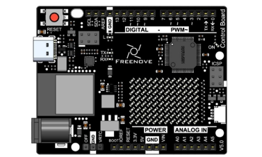
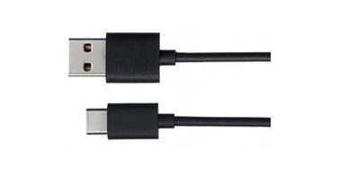
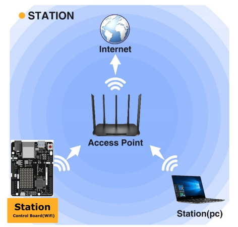
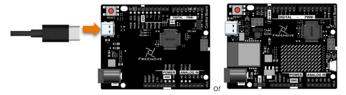
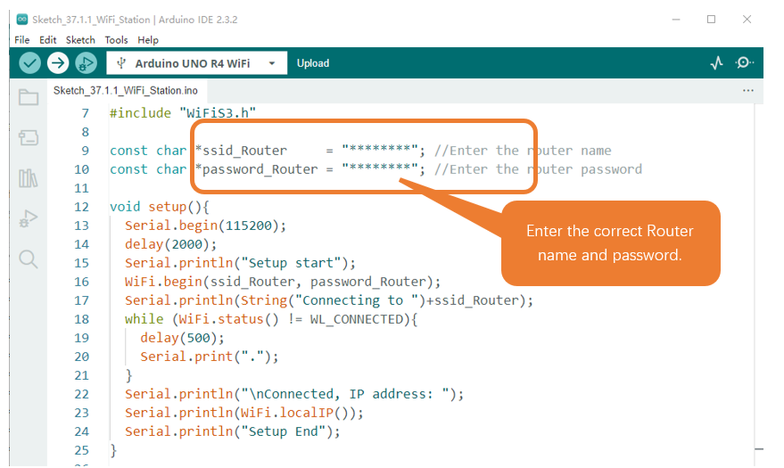
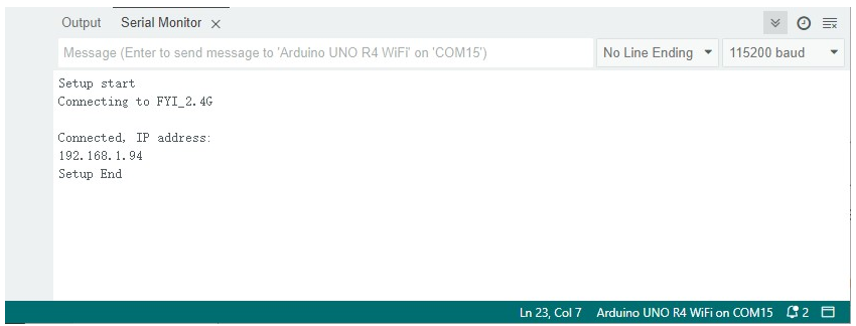
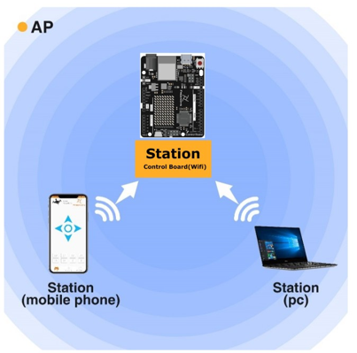
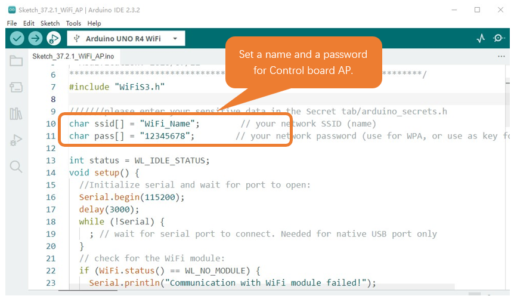
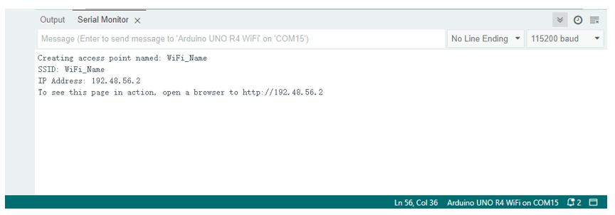
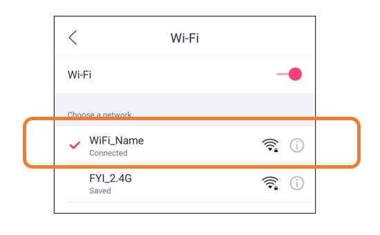

##############################################################################
Chapter WiFi Working Modes (WiFi Board)
##############################################################################

In this chapter, we'll focus on the WiFi infrastructure for control board. 

Control board has 3 different WiFi operating modes: station mode, AP mode and AP+station mode. All WiFi programming projects must be configured with WiFi operating mode before using WiFi, otherwise WiFi cannot be used.

Project Station mode
*******************************

Component List
======================================

.. list-table:: 
   :width: 60%
   :align: center

   * -  Control board x1
   * -  |Chapter40_04|
   * -  USB cable x1
   * -  |Chapter40_05|

    
Component knowledge
===============================

Station mode
------------------------------

When control board(wifi) selects Station mode, it acts as a WiFi client. It can connect to the router network and communicate with other devices on the router via WiFi connection. As shown below, the PC is connected to the router, and if control board(wifi) wants to communicate with the PC, it needs to be connected to the router.

Circuit
=========================

Connect the board to the computer using the USB cable.

Sketch
=============================

Sketch_38.1.1
----------------------------

Because the names and passwords of routers in various places are different, before the Sketch runs, users need to enter the correct router's name and password in the box as shown in the illustration above.

After making sure the router name and password are entered correctly, compile and upload codes to control board, open serial monitor and set baud rate to 115200. And then it will display as follows:

When control board successfully connects to “ssid_Router”, serial monitor will print out the IP address assigned to control board by the router.

The following is the program code:

.. literalinclude:: ../../../freenove_Kit/Sketches/Sketch_38.1.1_WiFi_Station/Sketch_38.1.1_WiFi_Station.ino
    :linenos: 
    :language: c
    :lines: 1-29
    :dedent:

Include the WiFi Library header file of control board.

.. literalinclude:: ../../../freenove_Kit/Sketches/Sketch_38.1.1_WiFi_Station/Sketch_38.1.1_WiFi_Station.ino
    :linenos: 
    :language: c
    :lines: 8-8
    :dedent:

Enter correct router name and password.

.. literalinclude:: ../../../freenove_Kit/Sketches/Sketch_38.1.1_WiFi_Station/Sketch_38.1.1_WiFi_Station.ino
    :linenos: 
    :language: c
    :lines: 10-11
    :dedent:

Set control board in Station mode and connect it to your router.

.. literalinclude:: ../../../freenove_Kit/Sketches/Sketch_38.1.1_WiFi_Station/Sketch_38.1.1_WiFi_Station.ino
    :linenos: 
    :language: c
    :lines: 17-17
    :dedent:

Check whether control board has connected to router successfully every 0.5s.

.. literalinclude:: ../../../freenove_Kit/Sketches/Sketch_38.1.1_WiFi_Station/Sketch_38.1.1_WiFi_Station.ino
    :linenos: 
    :language: c
    :lines: 19-22
    :dedent:

Serial monitor prints out the IP address assigned to control board.

.. literalinclude:: ../../../freenove_Kit/Sketches/Sketch_38.1.1_WiFi_Station/Sketch_38.1.1_WiFi_Station.ino
    :linenos: 
    :language: c
    :lines: 24-24
    :dedent:

Reference
----------------------------

.. py:function:: Class Station	

    Every time when using WiFi, you need to include header file "WiFiS3.h.".

    **begin(ssid, password,channel, bssid, connect):** control board is used as Station to connect hotspot.

    **ssid:** WiFi hotspot name

    **password:** WiFi hotspot password

    **channel:** WiFi hotspot channel number; communicating through specified channel; optional parameter 

    **bssid:** mac address of WiFi hotspot, optional parameter

    **connect:** blloean optional parameter, defaulting to true. If set as false, then control board won't connect WiFi.

    **config(local_ip, gateway, subnet, dns1, dns2):** set static local IP address.

        **local_ip:** station fixed IP address.

        **subnet:** subnet mask

        **dns1,dns2:** optional parameter. define IP address of domain name server

    **status:** obtain the connection status of WiFI

    **local IP():** obtian IP address in Station mode 

    **disconnect():** disconnect wifi

    **setAutoConnect(boolen):** set automatic connection Every time control board is power on, it will connect WiFi aitomatically.

    **setAutoReconnect(boolen):** set automatic reconnection Every time control board disconnects WiFi, it will reconnect to WiFi automatically.

Project AP mode
********************************

Component List & Circuit
==============================

Component List & Circuit are the same as in Section 30.1.

Component knowledge
=================================

AP mode
----------------------------

When control board selects AP mode, it creates a hotspot network that is separate from the Internet and waits for other WiFi devices to connect. As shown in the figure below, Control board is used as a hotspot. If a mobile phone or PC wants to communicate with control board, it must be connected to the hotspot of control board. Only after a connection is established with control board can they communicate.

Circuit
==================================

Connect the board to the computer using the USB cable.

Sketch
============================

Sketch_38.2.1
------------------------------

Before the Sketch runs, you can make any changes to the AP name and password for control board in the box as shown in the illustration above. Of course, you can leave it alone by default.

Compile and upload codes to control board, open the serial monitor and set the baud rate to 115200. And then it will display as follows.

When observing the print information of the serial monitor, turn on the WiFi scanning function of your phone, and you can see the ssid_AP on control board, which is called "WiFi_Name" in this Sketch. You can enter the password "12345678" to connect it or change its AP name and password by modifying Sketch.

Sketch_37.2_AP_mode
------------------------------

The following is the program code:

.. literalinclude:: ../../../freenove_Kit/Sketches/Sketch_38.2.1_WiFi_AP/Sketch_38.2.1_WiFi_AP.ino
    :linenos: 
    :language: c
    :lines: 1-71
    :dedent:

Include WiFi Library header file of control board. 

.. literalinclude:: ../../../freenove_Kit/Sketches/Sketch_38.2.1_WiFi_AP/Sketch_38.2.1_WiFi_AP.ino
    :linenos: 
    :language: c
    :lines: 8-8
    :dedent:

Enter correct AP name and password.

.. literalinclude:: ../../../freenove_Kit/Sketches/Sketch_38.2.1_WiFi_AP/Sketch_38.2.1_WiFi_AP.ino
    :linenos: 
    :language: c
    :lines: 11-12
    :dedent:

Check whether the AP is turned on successfully. If yes, print out IP and MAC address of AP established by control board. If no, print out the failure prompt. 

.. code-block:: c

    status = WiFi.beginAP(ssid, pass);
    if (status != WL_AP_LISTENING) {
        Serial.println("Creating access point failed");
        // don't continue
        while (true);
    }
    ...
    // wait 5 seconds for connection:
    delay(5000);
    // you're connected now, so print out the status
    printWiFiStatus();
    ...
    void printWiFiStatus() {
        // print the SSID of the network you're attached to:
        Serial.print("SSID: ");
        Serial.println(WiFi.SSID());

        // print your WiFi shield's IP address:
        IPAddress ip = WiFi.localIP();
        Serial.print("IP Address: ");
        Serial.println(ip);

        // print where to go in a browser:
        Serial.print("To see this page in action, open a browser to http://");
        Serial.println(ip);
    }