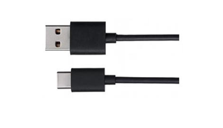
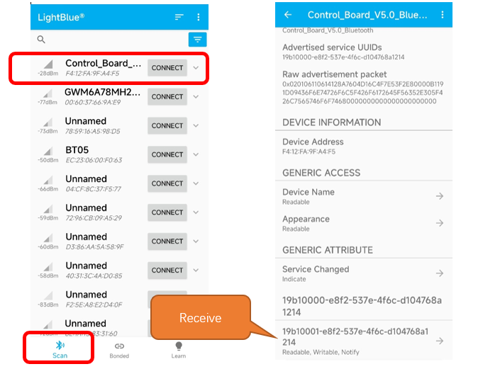
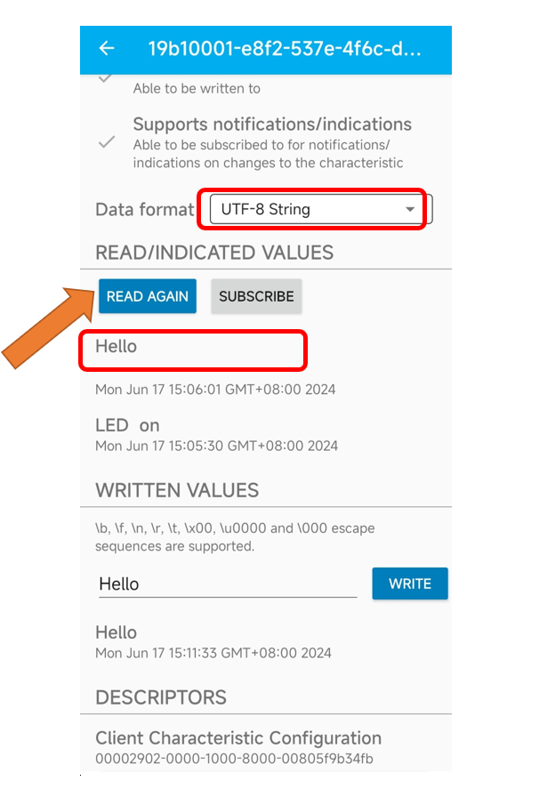

##############################################################################
Chapter Bluetooth (WiFi Board)
##############################################################################

In this chapter, we engage with  the onboard Bluetooth module. Bluetooth and Wi-Fi are common wireless communication technologies.

Project Bluetooth Low Energy Data Passthrough
************************************************************

this section, we first learn how to make simple data transmission between the control board (Bluetooth) and our phone.

Component List
======================================

.. list-table:: 
   :width: 100%
   :align: center

   * -  Control board x1
     -  USB cable x1
   * -  |Chapter40_04|
     -  |Chapter40_05|

.. |Chapter40_04| image:: ../_static/imgs/40_Control_LED_with_Web_(WiFi_Board)/Chapter40_04.png

Component knowledge
===========================

Control board's integrated Bluetooth function Bluetooth is a short-distance communication system, which can be divided into two types, namely Bluetooth Low Energy(BLE) and Classic Bluetooth. There are two modes for simple data transmission: master mode and slave mode.

Master mode
----------------------------

In this mode, works are done in the master device and it can connect with a slave device. And we can search and select slave devices nearby to connect with. When a device initiates connection request in master mode, it requires information of the other Bluetooth devices including their address and pairing passkey. After finishing pairing, it can connect with them directly.

Slave mode
---------------------------

The Bluetooth module in slave mode can only accept connection request from a host computer, but cannot initiate a connection request. After connecting with a host device, it can send data to or receive from the host device.

Bluetooth devices can make data interaction with each other, as one is in master mode and the other in slave mode. When they are making data interaction, the Bluetooth device in master mode searches and selects devices nearby to connect to. When establishing connection, they can exchange data. When mobile phones exchange data with Control board, they are usually in master mode and Control board in slave mode.

The control board is equipped with an ESP32 module, which provides Bluetooth and Wi-Fi functions, supporting speeds up to 2Mbps. The ESP32 module integrates a tracking antenna, which allows you to take advantage of the development board's connectivity without an external antenna. 

However, It is worth noting that the Wi-Fi and Bluetooth modules share the same antenna, which means you cannot use Bluetooth and Wi-Fi at the same time.

Circuit
===========================

Connect Freenove Control board to the computer using the USB cable.

.. image:: ../_static/imgs/7_Timer/Chapter07_01.png
    :align: center

Sketch
=======================

Lightblue
-------------------

If you can't install Serial Bluetooth on your phone, try LightBlue.If you do not have this software installed on your phone, you can refer to this link: https://apps.apple.com/us/app/lightblue/id557428110#?platform=iphone.

Step1. Upload the code of Project to control board.

Step2. Click on serial monitor.

Step3. Set baud rate to 9600.

Turn ON Bluetooth on your phone, and open the Lightblue APP. 

In the Scan page, swipe down to refresh the name of Bluetooth that the phone searches for. Click Control_Board_V5.0_Bluetooth.

Click “Receive”. Select the appropriate Data format in the box to the right of Data Format. For example, HEX for hexadecimal, utf-string for character, Binary for Binary, etc. Then click SUBSCRIBE.

Back to the serial monitor on your computer. You can type anything in the left border of Send, and then click Send. 

The last received data will be printed when the READ AGAIN button on the app is tapped. 

Similarly, you can select “Send” on your phone. Set Data format, and then enter anything in the sending box and click Write to send.

And the computer will receive the message from the mobile Bluetooth.

And now data can be transferred between your mobile phone and computer via control board.

The following is the program code:

.. literalinclude:: ../../../freenove_Kit/Sketches/Sketch_41.1.1_BLE_USART/Sketch_41.1.1_BLE_USART.ino
    :linenos: 
    :language: c
    :lines: 46-46
    :dedent:

Initialize the BLE function and name it.

.. literalinclude:: ../../../freenove_Kit/Sketches/Sketch_41.1.1_BLE_USART/Sketch_41.1.1_BLE_USART.ino
    :linenos: 
    :language: c
    :lines: 33-33
    :dedent:

Write a Callback function for BLE server to manage connection of BLE.

.. literalinclude:: ../../../freenove_Kit/Sketches/Sketch_41.1.1_BLE_USART/Sketch_41.1.1_BLE_USART.ino
    :linenos: 
    :language: c
    :lines: 67-75
    :dedent:

When the mobile phone send data to control board via BLE Bluetooth, it will print them out with serial port; When the serial port of control board receive data, it will send them to mobile via BLE Bluetooth.

.. code-block:: c

        if (Serial.available() > 0) {
            String str = Serial.readString();
            const char *newValue = str.c_str();
            switchCharacteristic.writeValue(newValue);
        }
    ...
    void switchCharacteristicWritten(BLEDevice central, BLECharacteristic characteristic) {
        Serial.print("Characteristic event, written: ");
        uint8_t characteristicValue[20];
        int bytesRead = characteristic.readValue(characteristicValue, sizeof(characteristicValue));
        Serial.print("Received bytes: ");
        for (int i = 0; i < bytesRead; i++) {
            Serial.print(characteristicValue[i], HEX);
            Serial.print(" ");
        }
        Serial.println();
        String receivedString = "";
        for (int i = 0; i < bytesRead; i++) {
            receivedString += (char)characteristicValue[i];
        }
        Serial.println("Value: " + receivedString);
    }

Project Control LED with Bluetooth
****************************************************

In this section, we will further learn how to use Bluetooth to control an LED.

Component List
===================================

.. list-table:: 
   :width: 100%
   :align: center

   * -  Control board x1
     -  Micro USB Wire x1
   * -  |Chapter41_23|
     -  |Chapter41_24|

If you do not have the above components in your kit, you can use the control board alone to finish the project. The control pin of the LED in this project is the same as the one controlling the onboard LED.

Sketch
=========================

Sketch_41.3.1
--------------------------

.. image:: ../_static/imgs/41_Bluetooth_(WiFi_Board)/Chapter41_25.png
    :align: center

Compile and upload code to Control board. The operation of the APP is the same as 40.1, you only need to change the sending content to "led_on" and "led_off" to operate LEDs on the Control board.

Data sent from mobile APP:

Display on the serial port of the computer:

The phenomenon of LED

Attention: If the sending content isn't "led-on' or "led-off", then the state of LED will not change. If the LED is on, when receiving irrelevant content, it keeps on; Correspondingly, if the LED is off, when receiving irrelevant content, it keeps off.

With this example you can design more interesting projects.

The following is the program code:

.. literalinclude:: ../../../freenove_Kit/Sketches/Sketch_41.2.1_Control_LED_with_Bluetooth/Sketch_41.2.1_Control_LED_with_Bluetooth.ino
    :linenos: 
    :language: c
    :lines: 1-95
    :dedent: