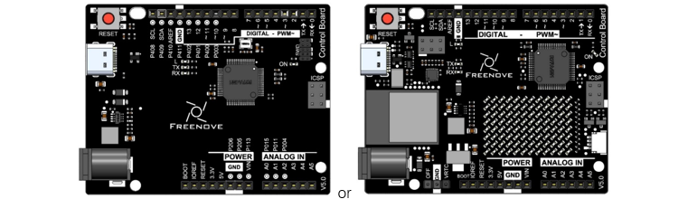
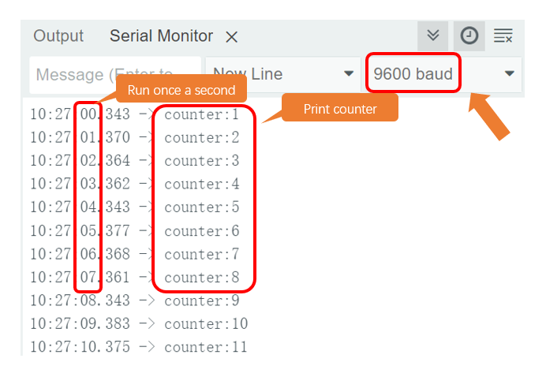

##############################################################################
Chapter Timer
##############################################################################

In this chapter, we will use the timer of the board, trigger the timer at intervals, thus allowing the serial port to print messages.

Project Serial print using timer
*********************************************

Component List
======================================

.. list-table:: 
   :width: 100%
   :align: center

   * -  Control board x1
   * -  |Chapter06_00|
   * -  USB cable x1
   * -  |Chapter06_01|

Code Knowledge
===========================

Timer
----------------------------

A Timer can be set to produce an interrupt after a period of time. When a timer interrupt occurs, the processor will jump to the interrupt function to process the interrupt event. And after completion the processing, execution will return to the interrupted location to go on. If you don't close the timer, interrupt will occur at the intervals you set.

Circuit
==========================

Connect control board to the computer with USB cable.

.. image:: ../_static/imgs/7_Timer/Chapter07_01.png
    :align: center

If you need any support, please feel free to contact us via: support@freenove.com

Sketch
===========================

This code uses a library named "CallbackTimerR4 ", if you have not installed it, please do so first.

Library is an important feature of the open source world, and we know that Arduino is an open source platform

that everyone can contribute to.

How to install the library
-------------------------------

open Arduino IDE, click Sketch -> Include Library -> Add .ZIP Library, In the pop-up window, find the file named "./Libraries/ **CallbackTimerR4-main.zip** " which locates in this directory, and click OPEN.

Sketch Serial_print_using_timer
--------------------------------

.. literalinclude:: ../../../freenove_Kit/Sketches/Sketch_7.1.1_Serial_print_using_timer/Sketch_7.1.1_Serial_print_using_timer.ino
    :linenos: 
    :language: c
    :lines: 1-34
    :dedent:

Verify and upload the code, open the Serial Monitor, and then you'll see data sent from control board.

If it is not displayed correctly, check whether the configuration of the Serial Monitor in the lower right corner of the window is correct. 

Project Using timer to implement LED blinking
*******************************************************

Component List
======================================

.. list-table:: 
   :width: 100%
   :align: center

   * -  Schematic diagram
   * -  |Chapter06_00|
   * -  Hardware connection 
     
        If you need any support, please feel free to contact us via: support@freenove.com

   * -  |Chapter06_01|

Circuit
====================================

Connect control board to the computer with USB cable.

If you need any support, please feel free to contact us via: support@freenove.com

Sketch
=================================

Sketch Using_timer_to_implement_LED_blinking
----------------------------------

.. literalinclude:: ../../../freenove_Kit/Sketches/Sketch_7.2.1_Using_timer_to_implement_LED_blinking/Sketch_7.2.1_Using_timer_to_implement_LED_blinking.ino
    :linenos: 
    :language: c
    :lines: 1-29
    :dedent:

Verify and upload the code, then you will see the LED light starts to flash with a period of 1 second

