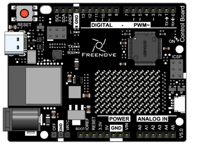
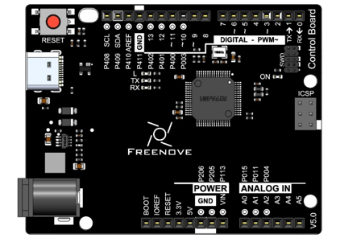
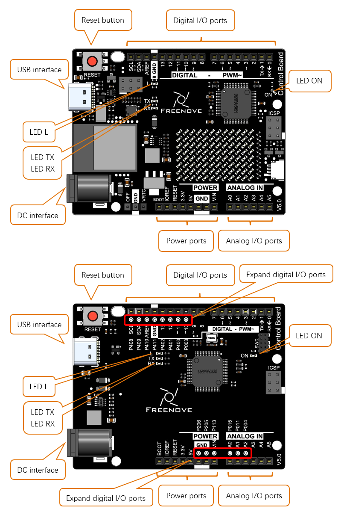

##############################################################################
Preface
##############################################################################

If you want to make some interesting projects or want to learn electronics and programming, this document will greatly help you.

Projects in this document usually contains two parts: the circuit and the code. No experience at all? Don't worry, this document will show you how to start from scratch.

If you encounter any problems, please feel free to send us an email, we will try our best to help you.

Support email: support@freenove.com

To complete these projects, you need to use a control board and software to program it, as well as some commonly used components.

Control Board
*******************************

The control board is the core of a circuit. After programming, it can be used to control other components in the circuit to achieve intended functions.

There are multiple versions of Freenove control board. Your purchase may be one of the following:

.. list-table:: 
   :width: 100%
   :header-rows: 1 
   :align: center
   
   * -  Freenove Control Board (WiFi)
     -  Freenove Control Board (minina)

   * -  |Preface00|
     -  |Preface01|

Diagram of the Freenove control board is shown below:

- Digital I/O ports is used to connect to other components or modules, to receive an input signal, or to send a control signal. Usually, we name it by adding a "D" in front of the number, such as D13 (pin 13).

- USB interface is used to provide power, upload code or communicate with PC. 

- LED L is connected to digital I/O port 13 (pin 13).

- LED TX, RX is used to indicate the state of the serial communication. 

- DC interface is connected DC power to provide power for the board.

- Power ports can provide power for electronic components and modules.

- Analog I/O ports can be used to measure analog signals. 

- LED ON is used to indicate the power state.