##############################################################################
Chapter Voltmeter
##############################################################################

In this chapter, we will use a control board and Processing to make a simple voltmeter to understand the

mutual communication between them.

Project 1.1 Voltmeter
**********************************

First, make a simple voltmeter.

Component List
==============================

+------------------------------------------------------+
| Control board x1                                     |
|                                                      |
| |Chapter01_00|                                       |
+--------------------------+---------------------------+
| Breadboard x1            | GPIO Extension Board x1   |
|                          |                           |
| |Chapter02_00|           | |Chapter02_01|            |
+------------------+-------+---------------------------+
| USB cable x1     | Jumper M/M x3                     |
|                  |                                   |
| |Chapter01_02|   | |Chapter01_03|                    |
+------------------+-----------------------------------+
| Rotary potentiometer x2                              |
|                                                      |
| |Chapter08_00|                                       |
+------------------------------------------------------+

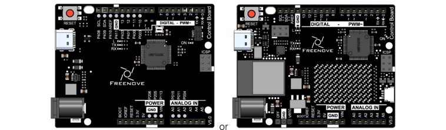

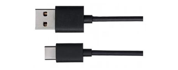

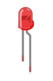
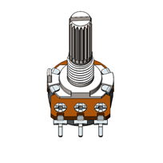
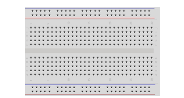
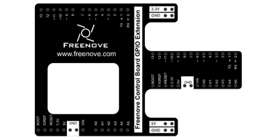

Circuit
==================

Use A0 port to detect the voltage of rotary potentiometer. 

.. list-table:: 
   :width: 100%
   :align: center

   * -  Schematic diagram
   * -  |Chapter1_00|
   * -  Hardware connection 
     
        If you need any support, please feel free to contact us via: support@freenove.com

   * -  |Chapter1_01|

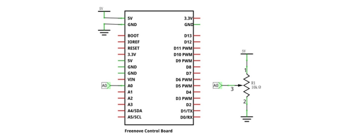
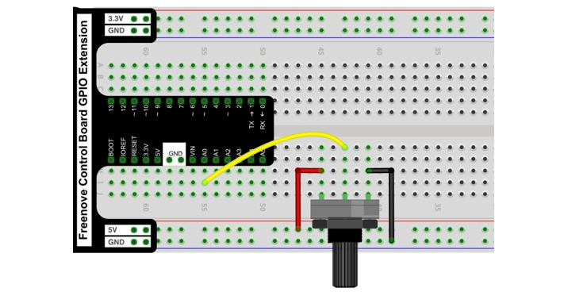

Sketch
======================

Before running Processing sketch, make sure that SerialDevice.ino is uploaded to the control board.

Processing sketches is stored under the Processing\\Processing folder.

Sketch Voltmeter
----------------------------

Use Processing to open **.\\Processing\\Processing\\Voltmeter\\Voltmeter.pde and click Run** . 

Then, the following window will pop up and its connection to the control board will be started.

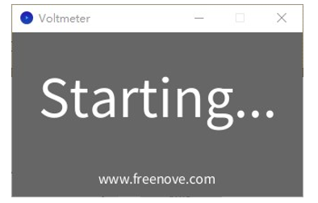

If the control board has not been connected to computer, please connect the control board to your computer.

If the connection succeeds, the following will be shown:

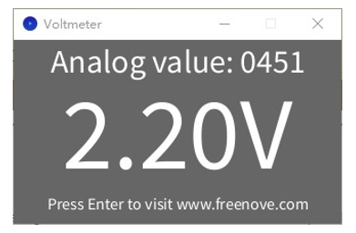

This sketch will obtain analog value from A0 port of control board, and convert it to voltage value to display.

You can adjust the potentiometer to observe the change of value, and you can also use the A0 port to measure

voltage value of other circuits. Note that the measurement voltage cannot exceed 5V, otherwise it will cause damage to the control board.

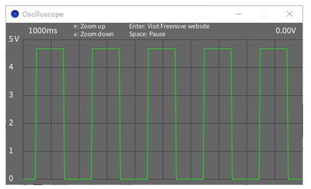

The left side of the software interface is a voltage scale, which is used to indicate the voltage of the waveform.

The "1000ms" on top left corner is the time of a square, and you can press “↑” and “↓” key on keyboard to adjust it.

The "0.00V" on top right corner is the voltage value of current signal.

You can press the space bar on keyboard to pause the display waveform, which is easy to view and analysis.

We believe that with the help of this oscilloscope, you can obtain more intuitive understanding of the actual work of some electronic circuits. It will help you complete the project and eliminate the trouble. You can export this sketch to an application used as a tool.

Project 1.2 Dual-Channel Voltmeter
*********************************************

Now, let's make a dual-channel voltmeter.

Component list
==================================

+------------------------------------------------------+
| Control board x1                                     |
|                                                      |
| |Chapter01_00|                                       |
+--------------------------+---------------------------+
| Breadboard x1            | GPIO Extension Board x1   |
|                          |                           |
| |Chapter02_00|           | |Chapter02_01|            |
+------------------+-------+---------------------------+
| USB cable x1     | Jumper M/M x3                     |
|                  |                                   |
| |Chapter01_02|   | |Chapter01_03|                    |
+------------------+-----------------------------------+
| Rotary potentiometer x2                              |
|                                                      |
| |Chapter08_00|                                       |
+------------------------------------------------------+

Circuit
====================================

Use A0, A1 ports on the control board to detect the voltage of rotary potentiometers.

.. list-table:: 
   :width: 100%
   :align: center

   * -  Schematic diagram
   * -  |Chapter1_05|
   * -  Hardware connection 
     
        If you need any support, please feel free to contact us via: support@freenove.com

   * -  |Chapter1_06|

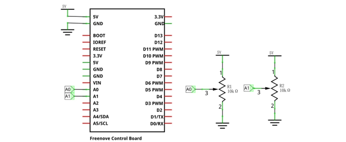
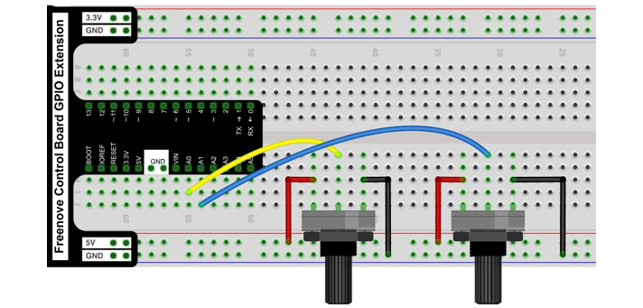

Sketch
============================

Sketch Voltmeter_Dual_Channel
--------------------------------------

Use Processing to open .\\Processing\\Processing\\Voltmeter_Dual_Channel\\Voltmeter_Dual_Channel.pde and click Run. 

Then, the following window will pop up and its connection to control board will be started.

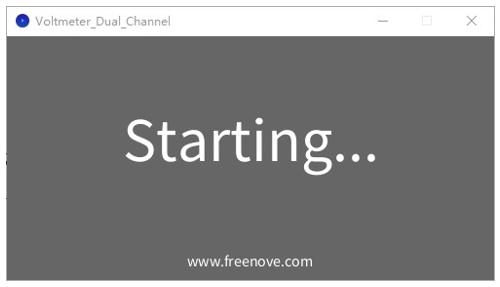

If you have not yet connect the control board to your computer, please do so. If the connection succeeds, the following will be shown:

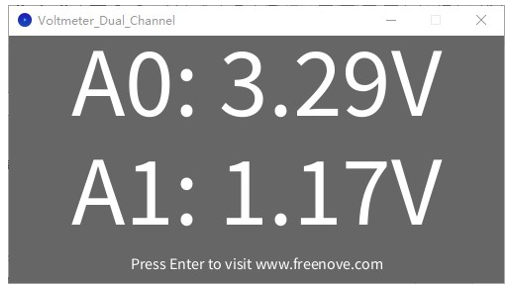

This sketch will obtain analog values from A0 and A1 ports of control board, and convert them to voltage value to display. You can adjust the potentiometers to observe the change of value, and you can also use the

A0 and A1 ports to measure voltage value of other circuits. Note that the measurement voltage cannot exceed

5V, ortherwise it will cause damage to the control board.

You can export the two Processing sketches in this chapter to the application as common tools.