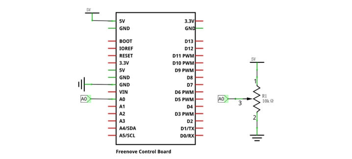
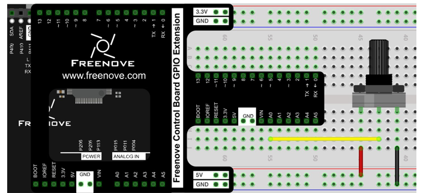

##############################################################################
Chapter Oscilloscope
##############################################################################

We have implemented a simple virtual instrument voltmeter earlier. In this chapter, we will make a more

complex virtual instrument, oscilloscope. Oscilloscope is a widely used electronic measuring instrument. It can

get the electrical signals that cannot be observed directly into visible image to facilitate the analysis and study

the changing process of various electrical signals.

Project 2.1 Oscilloscope
*************************************

Now, let's use Processing and control board to achieve an oscilloscope.

Component list
======================

+------------------------------------------------------+
| Control board x1                                     |
|                                                      |
| |Chapter01_00|                                       |
+--------------------------+---------------------------+
| Breadboard x1            | GPIO Extension Board x1   |
|                          |                           |
| |Chapter02_00|           | |Chapter02_01|            |
+------------------+-------+---------------------------+
| USB cable x1     | Jumper M/M x3                     |
|                  |                                   |
| |Chapter01_02|   | |Chapter01_03|                    |
+------------------+-----------------------------------+
| Rotary potentiometer x2                              |
|                                                      |
| |Chapter08_00|                                       |
+------------------------------------------------------+

.. |Chapter01_00| image:: ../_static/imgs/1_LED_Blink/Chapter01_00.png
.. |Chapter01_01| image:: ../_static/imgs/1_LED_Blink/Chapter01_01.png
.. |Chapter01_02| image:: ../_static/imgs/1_LED_Blink/Chapter01_02.png
.. |Chapter01_03| image:: ../_static/imgs/1_LED_Blink/Chapter01_03.png
.. |Chapter01_04| image:: ../_static/imgs/1_LED_Blink/Chapter01_04.png
.. |Chapter08_00| image:: ../_static/imgs/8_ADC/Chapter08_00.png
.. |Chapter02_00| image:: ../_static/imgs/2_Two_LEDs_Blink/Chapter02_00.png
.. |Chapter02_01| image:: ../_static/imgs/2_Two_LEDs_Blink/Chapter02_01.png

Circuit
==================

Use A0 port to detect the voltage of rotary potentiometer. 

.. list-table:: 
   :width: 100%
   :align: center

   * -  Schematic diagram
   * -  |Chapter2_00|
   * -  Hardware connection 
     
        If you need any support, please feel free to contact us via: support@freenove.com

   * -  |Chapter2_01|

Sketch
=======================

Sketch Oscilloscope
-------------------------

Use Processing to open .\\Processing\\Processing\\Oscilloscope\\Oscilloscope.pde and click Run. 

If the connection succeeds, the following will be shown:

The green line is the waveform acquisited. Rotate the potentiometer, then you can see changes of the waveform:

Disconnect the A0 port from the potentiometer and connect it to the Pin 13 port. Pin 13 port output is 0.5Hz square wave. As is shown below:

.. image:: ../_static/imgs/2_Oscilloscope/Chapter2_04.png
    :align: center

The left side of the software interface is a voltage scale, which is used to indicate the voltage of the waveform.

The "1000ms" on top left corner is the time of a square, and you can press “↑” and “↓” key on keyboard to adjust it.

The "0.00V" on top right corner is the voltage value of current signal.

You can press the space bar on keyboard to pause the display waveform, which is easy to view and analysis.

We believe that with the help of this oscilloscope, you can obtain more intuitive understanding of the actual work of some electronic circuits. It will help you complete the project and eliminate the trouble. You can export this sketch to an application used as a tool.