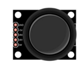

##############################################################################
Chapter Control 2D and 3D Figures
##############################################################################

In this chapter, we will use the connect board to make Processing program display changes of figures. And

we will control 2D and 3D figures respectively.

Project 3.1 Ellipse
*******************************

Now, let's use Processing and control board to achieve an oscilloscope.

Component list
==========================

+------------------------------------------------------+
| Control board x1                                     |
|                                                      |
| |Chapter01_00|                                       |
+--------------------------+---------------------------+
| Breadboard x1            | GPIO Extension Board x1   |
|                          |                           |
| |Chapter02_00|           | |Chapter02_01|            |
+------------------+-------+---------------------------+
| USB cable x1     | Jumper M/M x3                     |
|                  |                                   |
| |Chapter01_02|   | |Chapter01_03|                    |
+------------------+-----------------------------------+
| Joystick x1                                          |
|                                                      |
| |Chapter16_00|                                       |
+------------------------------------------------------+

.. |Chapter01_00| image:: ../_static/imgs/1_LED_Blink/Chapter01_00.png
.. |Chapter01_02| image:: ../_static/imgs/1_LED_Blink/Chapter01_02.png
.. |Chapter01_03| image:: ../_static/imgs/1_LED_Blink/Chapter01_03.png
.. |Chapter02_00| image:: ../_static/imgs/2_Two_LEDs_Blink/Chapter02_00.png
.. |Chapter02_01| image:: ../_static/imgs/2_Two_LEDs_Blink/Chapter02_01.png

Circuit
==============================

Use pin A0 and pin A1 on control board to detect the voltage value of two rotary potentiometers inside Joystick, and use pin 8 port to detect the vertical button.

.. list-table:: 
   :width: 100%
   :align: center

   * -  Schematic diagram
   * -  |Chapter3_00|
   * -  Hardware connection 
     
        If you need any support, please feel free to contact us via: support@freenove.com

   * -  |Chapter3_01|

Sketch
===========================

Sketch Ellipse
---------------------------

Use Processing to open .\\Processing\\Processing\\Ellipse\\Ellipse.pde and click Run. 

If the connection succeeds, the following will be shown:

Then you can change the shape of the ellipse by shifting the joystick:

Project 3.2 Box 3D
***************************

Now control 3D figures.

Component list
=============================

The same as previous section.

Circuit
==============================

The same as previous section.

Sketch
============================

Sketch Box_3D
-------------------------------

Use Processing to open **.\\Processing\\Processing\\Box_3D\\Box_3D.pde** and click Run. 

If the connection succeeds, the following will be shown.

The left is a 3D box presented by line and the right is a 3D box entity.

Then you can change the space angle of two 3D boxes by shifting the joystick:

