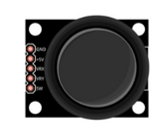
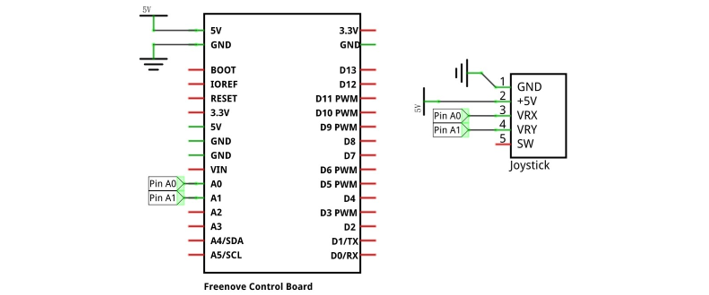
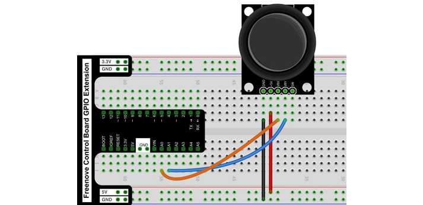
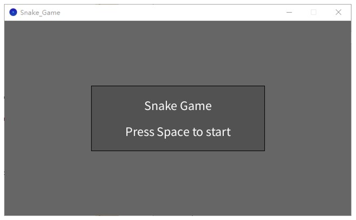
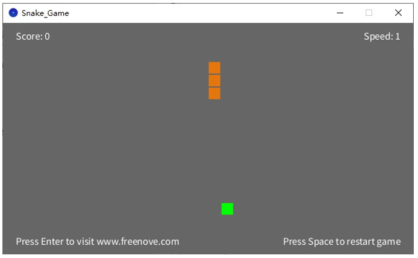
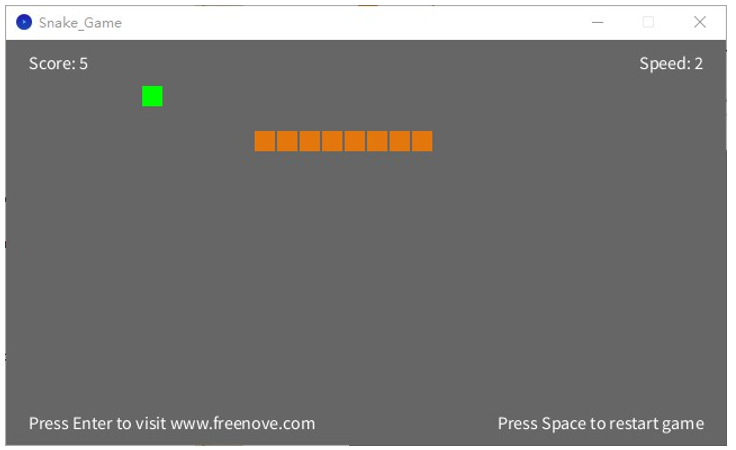
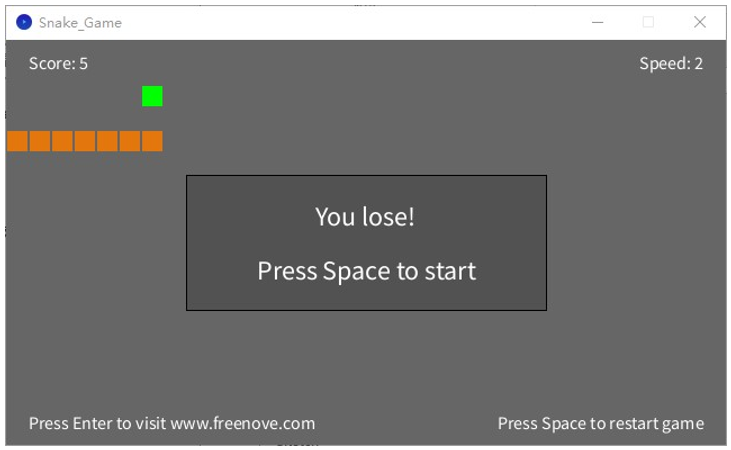
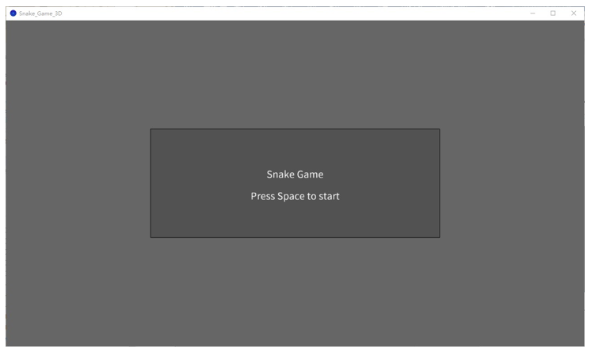
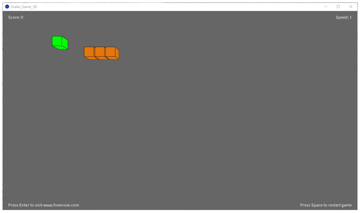
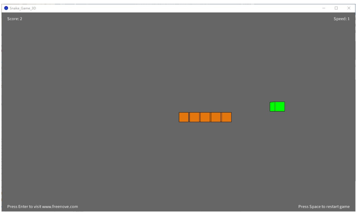

##############################################################################
Chapter Snake Game
##############################################################################

We have learned how control 2D and 3D figures. Now, we will use control board to play the classic snake game. There are both 2D and 3D version.

Project 4.1 Snake Game
*******************************

First, let's play a 2D snake game.

Component list 
=============================

+------------------------------------------------------+
| Control board x1                                     |
|                                                      |
| |Chapter01_00|                                       |
+--------------------------+---------------------------+
| Breadboard x1            | GPIO Extension Board x1   |
|                          |                           |
| |Chapter02_00|           | |Chapter02_01|            |
+------------------+-------+---------------------------+
| USB cable x1     | Jumper M/M x3                     |
|                  |                                   |
| |Chapter01_02|   | |Chapter01_03|                    |
+------------------+-----------------------------------+
| Joystick x1                                          |
|                                                      |
| |Chapter16_00|                                       |
+------------------------------------------------------+

.. |Chapter01_00| image:: ../_static/imgs/1_LED_Blink/Chapter01_00.png
.. |Chapter01_02| image:: ../_static/imgs/1_LED_Blink/Chapter01_02.png
.. |Chapter01_03| image:: ../_static/imgs/1_LED_Blink/Chapter01_03.png
.. |Chapter02_00| image:: ../_static/imgs/2_Two_LEDs_Blink/Chapter02_00.png
.. |Chapter02_01| image:: ../_static/imgs/2_Two_LEDs_Blink/Chapter02_01.png

Circuit
==============================

Use pin A0 and pin A1 on control board to detect the voltage value of two rotary potentiometers inside Joystick, and use pin 8 port to detect the vertical button.

.. list-table:: 
   :width: 100%
   :align: center

   * -  Schematic diagram
   * -  |Chapter4_00|
   * -  Hardware connection 
     
        If you need any support, please feel free to contact us via: support@freenove.com

   * -  |Chapter4_01|

Sketch
=============================

Sketch Snake_Game
-----------------------------

Use Processing to open .\\Processing\\Processing\\Box_3D\\Box_3D.pde, and click Run. 

If the connection succeeds, the follow will be shown:

Press the space bar on keyboard to start the game:

Press the corresponding button to control the snake's movements. The game rules are the same as the classic snake game:

When the game fails, press space bar to restart the game:

Additionally, you can restart the game by pressing the space bar at any time.

Project 4.2 Snake Game 3D
*******************************

Now, let's experience the 3D version game.

Component list
=========================

The same as last section.

Circuit
=========================

The same as last section.

Sketch
=======================

Sketch Snake_Game_3D
-------------------------

Use Processing to open .\\Processing\\Processing\\Snake_Game_3D\\Snake_Game_3D.pde and click Run.

If the connection succeeds, the follow will be shown:

Press the space bar on keyboard to start the game:

Press the corresponding button to control the snake's movements. The game rules are the same as the classic snake game:

The rest operation is the same as the 2D version.