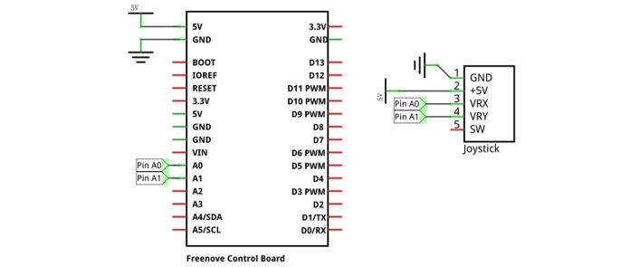
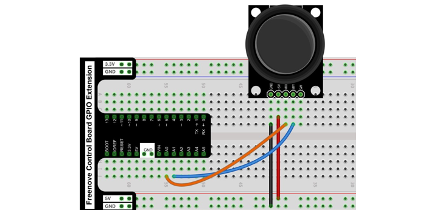
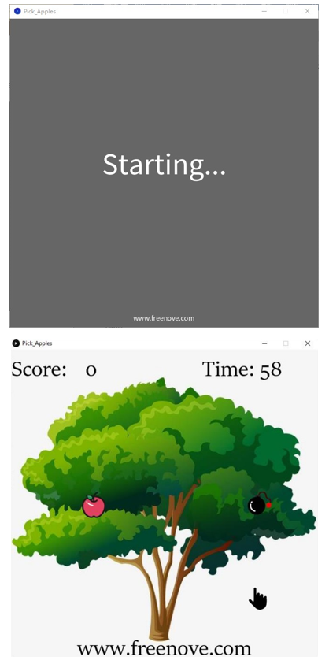
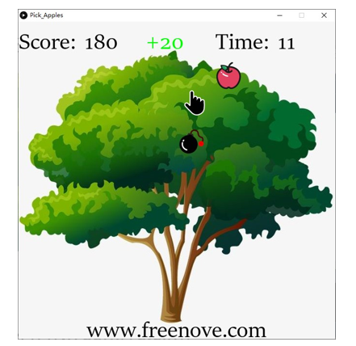
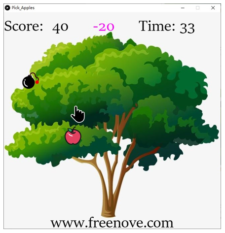
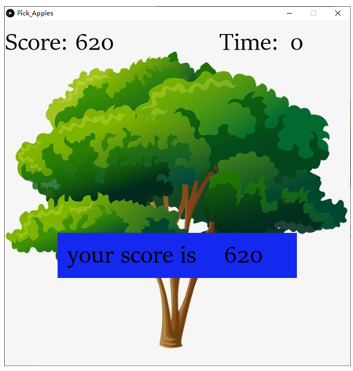

##############################################################################
Chapter Pick Apples
##############################################################################

In this chapter, we prepare pick apples game.You can pick apples with four buttons.

Project 5.1 Pick Apples
*********************************

Now, let's use Processing and control board to achieve the game.

Component list
==========================

+------------------------------------------------------+
| Control board x1                                     |
|                                                      |
| |Chapter01_00|                                       |
+--------------------------+---------------------------+
| Breadboard x1            | GPIO Extension Board x1   |
|                          |                           |
| |Chapter02_00|           | |Chapter02_01|            |
+------------------+-------+---------------------------+
| USB cable x1     | Jumper M/M x3                     |
|                  |                                   |
| |Chapter01_02|   | |Chapter01_03|                    |
+------------------+-----------------------------------+
| Joystick x1                                          |
|                                                      |
| |Chapter16_00|                                       |
+------------------------------------------------------+

.. |Chapter01_00| image:: ../_static/imgs/1_LED_Blink/Chapter01_00.png
.. |Chapter01_02| image:: ../_static/imgs/1_LED_Blink/Chapter01_02.png
.. |Chapter01_03| image:: ../_static/imgs/1_LED_Blink/Chapter01_03.png
.. |Chapter02_00| image:: ../_static/imgs/2_Two_LEDs_Blink/Chapter02_00.png
.. |Chapter02_01| image:: ../_static/imgs/2_Two_LEDs_Blink/Chapter02_01.png
.. |Chapter16_00| image:: ../_static/imgs/16_Joystick/Chapter16_00.png   

Circuit
==============================

Use pin A0 and pin A1 on control board to detect the voltage value of two rotary potentiometers inside Joystick, and use pin 8 port to detect the vertical button.

.. list-table:: 
   :width: 100%
   :align: center

   * -  Schematic diagram
   * -  |Chapter5_00|
   * -  Hardware connection 
     
        If you need any support, please feel free to contact us via: support@freenove.com

   * -  |Chapter5_01|

Sketch
=============================

Sketch Pick Apples
---------------------------

Use Processing to open .\\Processing\\Processing\\Pick_Apples\\Pick_Apples.pde, and click Run. 

If the connection succeeds, the follow will be shown:

You can control the game with the corresponding buttons. When the palm picked the apple, score +20. 

If the palm touches the bomb, the score is -20.

At the same time, you need to pick as many apples as possible before the countdown is over. 

When the game fails, press space bar to restart the game:

Additionally, you can restart the game by pressing the space bar at any time.