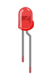
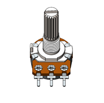
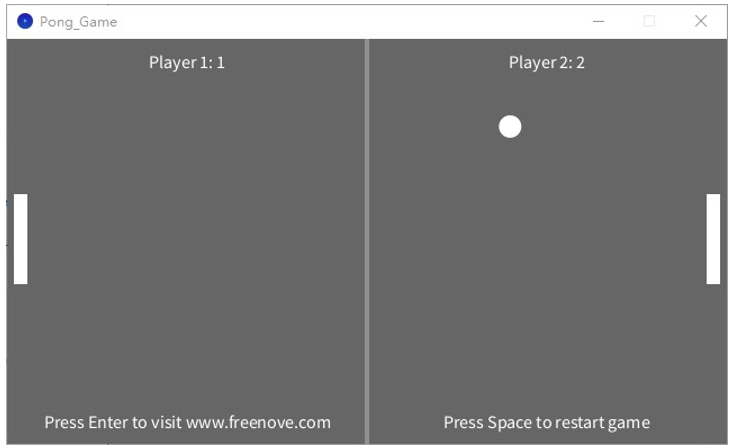

##############################################################################
Chapter Pong Game
##############################################################################

We have experienced single-player game snake before. Now, let's use control board to play classic two-player pong game. You will experience both 2D and 3D version.

Project 6.1 Pong Game
********************************

First, let's experience the 2D version game.

Component list
===============================

+------------------------------------------------------+
| Control board x1                                     |
|                                                      |
| |Chapter01_00|                                       |
+--------------------------+---------------------------+
| Breadboard x1            | GPIO Extension Board x1   |
|                          |                           |
| |Chapter02_00|           | |Chapter02_01|            |
+------------------+-------+---------------------------+
| USB cable x1     | Jumper M/M x3                     |
|                  |                                   |
| |Chapter01_02|   | |Chapter01_03|                    |
+------------------+-----------------------------------+
| Rotary potentiometer x2                              |
|                                                      |
| |Chapter08_00|                                       |
+------------------------------------------------------+

.. |Chapter01_00| image:: ../_static/imgs/1_LED_Blink/Chapter01_00.png

.. |Chapter01_02| image:: ../_static/imgs/1_LED_Blink/Chapter01_02.png
.. |Chapter01_03| image:: ../_static/imgs/1_LED_Blink/Chapter01_03.png

.. |Chapter02_00| image:: ../_static/imgs/2_Two_LEDs_Blink/Chapter02_00.png
.. |Chapter02_01| image:: ../_static/imgs/2_Two_LEDs_Blink/Chapter02_01.png

Circuit
==============================

Use A0, A1 ports on connect board to detect the voltage of rotary potentiometers.

.. list-table:: 
   :width: 100%
   :align: center

   * -  Schematic diagram
   * -  |Chapter6_00|
   * -  Hardware connection 
     
        If you need any support, please feel free to contact us via: support@freenove.com

   * -  |Chapter6_01|

.. |Chapter6_01| image:: ../_static/imgs/6_Pong_Game/Chapter6_01.png

Sketch
=============================

Sketch Pong_Game
----------------------------

Use Processing to open **.\\Processing\\Processing\\Pong_Game\\Pong_Game.pde** ,and click Run.

If the connection succeeds, the follow will be shown:

Now you can try to control the racket motion by pressing the corresponding button. Press space bar to start the game: 

Use button to control the movement of paddle to block the ball back. The game rules are the same as classic pong game:

The game will be over when one side reachs three points. Pressing the space bar can restart the game:

Additionally, you can restart the game by pressing the space bar at any time.

Project 6.2 Pong Game 3D
*********************************

Now, let’s experience the 3D version game.

Component list
==================================

The same as last section.

Circuit
===============================

The same as last section.

Sketch
===========================

Sketch Pong_Game_3D
-----------------------------

Use Processing to open **.\\Processing\\Processing\\Pong_Game_3D\\Pong_Game_3D.pde** , and click Run.

If the connection succeeds, the follow will be shown:

Now you can try to control the racket motion by pressing the corresponding button. Press space bar to start the game: 

Use button to control the movement of paddle to block the ball back. The game rules are the same as classic pong game:

The rest operation is the same as the 2D version.
