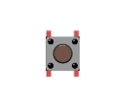
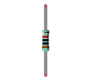
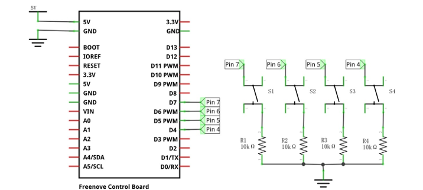
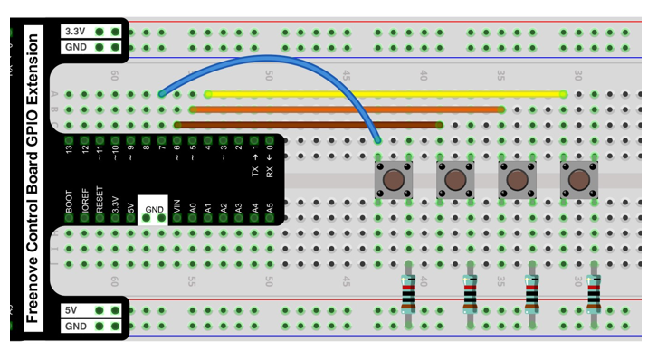
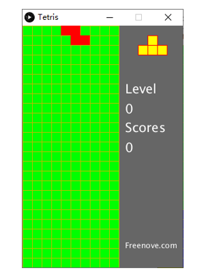
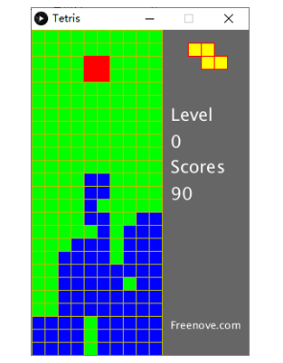
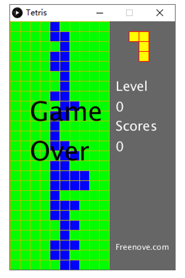

##############################################################################
Chapter Tetris
##############################################################################

In this chapter, we prepare a tetris game for you. You can play the game by pressing the buttons.

Project 7.1 Tetris
********************************

Now, let's use Processing and control board to achieve the tetris game.

Component list
=============================

+------------------------------------------------------+
| Control board x1                                     |
|                                                      |
| |Chapter01_00|                                       |
+--------------------------+---------------------------+
| Breadboard x1            | GPIO Extension Board x1   |
|                          |                           |
| |Chapter02_00|           | |Chapter02_01|            |
+------------------+-------+---------------------------+
| USB cable x1     | Jumper M/M x3                     |
|                  |                                   |
| |Chapter01_02|   | |Chapter01_03|                    |
+------------------+------+----------------------------+
| Push button x4          | Resistor 10kΩ x4           |
|                         |                            |
| |Chapter07_00|          |  |Chapter07_01|            |
+-------------------------+----------------------------+

.. |Chapter01_00| image:: ../_static/imgs/1_LED_Blink/Chapter01_00.png
.. |Chapter01_01| image:: ../_static/imgs/1_LED_Blink/Chapter01_01.png
.. |Chapter01_02| image:: ../_static/imgs/1_LED_Blink/Chapter01_02.png
.. |Chapter01_03| image:: ../_static/imgs/1_LED_Blink/Chapter01_03.png
.. |Chapter01_04| image:: ../_static/imgs/1_LED_Blink/Chapter01_04.png

.. |Chapter02_00| image:: ../_static/imgs/2_Two_LEDs_Blink/Chapter02_00.png
.. |Chapter02_01| image:: ../_static/imgs/2_Two_LEDs_Blink/Chapter02_01.png

Circuit
==================

Use GPIO4, GPIO5, GPIO6, GPIO7 port on control board to control the movement of the block.

.. list-table:: 
   :width: 100%
   :align: center

   * -  Schematic diagram
   * -  |Chapter7_02|
   * -  Hardware connection 
     
        If you need any support, please feel free to contact us via: support@freenove.com

   * -  |Chapter7_03|

Sketch
=====================

Sketch Tetris
----------------------

Use Processing to open .\\Processing\\Processing\\Tetris.pde\\Tetris.pde ,and click Run.

If the connection succeeds, the follow will be shown:

Now you can try using the buttons to control the falling block. Press the space bar to pause the game. 

When the game is over, you can press the space bar to play the game again. Press ESC to exit the game. 

